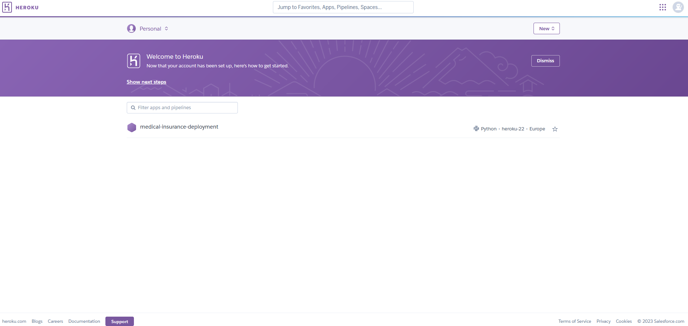

# MEDICAL INSURANCE COST PREDICTION TOOL

## Introduction

This is an end-to-end Machine Learning project I carried out during my free time with the aim of improving my skills and getting more familiar with Machine Learning workflows.
Since it is an end-to-end project, it covers these steps:

- Data acquisition
- Model development
- Front-end and back-end development
- Model deployment
 

## Model development
The medical insurance cost dataset was downloaded from Kaggle (https://www.kaggle.com/). The dataset contained 7 variables: age, sex, bmi, children, smoker, region and charges (the variable we want to predict). A jupyter notebook was created in order to carry out the exploratory data analysis (EDA) and build the model. After the EDA, a label encoder was used to transform non-numerical categorical variables (sex, smoker, region) into numerical variables. Then, the data was split into the train and test set and some regressor models were tried (linear regression, random forest regressor and polynomial regressor) to predict our target variable (charges). The different algorithms were compared based on their MSE, RMSE, MAE, R2 score and cross validation score. 

Following the obtained metrics during the evaluation of the model, it was decided to use a random forest regressor algorithm. Finally, the model and the different label encoders used were saved as a .joblib file.
You can find the jupyter notebook used for this part of the project in this repository (Medical-insurance.ipynb). In the jupyter notebook you have a wider description of the variables and the followed steps.
 

## Front-end and back-end development
The back-end of the application was built using Python's framework Flask. 
The front-end of the application was built with HTML. Categorical variables have a dropdown for their selection. 
First, the app loads the ML model and receives the inputs from the user. Then, it processes these inputs with the label encoder (if the variable is non-numerical) and then uses the machine learning model to make a prediction based on the input data. The prediction result is then returned to the HTML file. 

Here is an overview of the result:

 

## Model deployment
The model was deployed using Heroku. This process was relatively straightforward, but since there is no free tier anymore on Heroku, I decided to record a brief demonstration of the app instead of leaving the application running 24/7.

To see the video demonstration, click to the image below and you will be redirected:

 
 

### Installation and usage
In this repository you will find a folder with all the project files: 

- app.py contains the flask app
- Inside the templates folder there is the HTML file of the front-end
- Inside the static folder there is the picture that appears on the page
- Procfile, runtime.txt and wsgi.py are files needed to deploy the app with Heroku
- requirements.txt can be used to install the necessary dependencies on your environment
- You will find the .joblib model and the three label encoders

Additionally, I will publish the jupyter notebook I used for obtaining the model and the video demonstration in the repository. 
 

### Conclusion
During the development of this project, I had to face many challenges. The model development was relatively smooth since the data was very user-friendly and appropriate for beginners. Therefore, I would say that the most challenging part was creating the application itself. I had previously worked with Flask but it was my first time developing any front-end, so I really struggled at the beginning to create the HTML file. The deployment at first was also a bit challenging because I wanted to deploy it using AWS but the dependencies were very big. I came across a videotutorial about Heroku and it turned out to be the perfect and easiest solution for my case. 

In the end, I was able to overcome all these challenges and finish my first end-to-end Machine Learning project. After the developing of this project, I can say I have improved my problem-solving abilities and learned a lot of new things.

Hope you find this project as exciting as I do, and I am open to any suggestions and improvements :)

